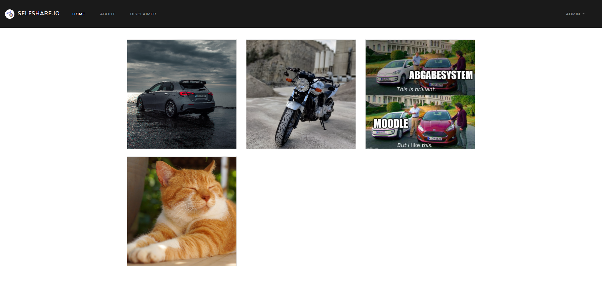

# selfshare

By
- Max Ermackov - 7055197
- Makss Golubs - 1871161

Create your portfolio and share your images on your own server. Customize it to your preferences.

## Features
- There is a main view for guests, and an admin view for the admin (dashboard)
- Admin can:
  - Create, remove, edit and organize galleries (with name and description)
  - Upload images (with name and description, both optional) into galleries
  - Edit, remove and organize images
  - Set uploaded images as gallery thumbnail
  - Edit author page
  - Change admin username and password, automatic generation is possible
  - Change look of the site (title, theme and description)
  - Edit disclaimer page
  - Author, disclaimer and design page contain 
- Users can:
  - Navigate through homepage, galleries, view images in large view
  - Have a look on the about and disclaimer page
- Functional:
  - Bookmarking and sharing: every page, gallery and image is uniquely defined with an url
  - Passwords are hashed in database
  - Admin client will keep logged in without saving of the raw credentials
  - Images are stored in 3 sizes to increase loading performance
  - Images without a title will not have the hover effect
  

## Development Environment
- Clone the project
- If not already installed, download Node.js at https://nodejs.org/en/download

### 1. MySQL Database (Manual)
- If needed refer to [How to install MySQL Server in Docker Container](DOCKER_MYSQL.md)
- add user and database called selfshare (with all rights)
- do this inside MYSQL console: ``ALTER USER 'selfshare' IDENTIFIED WITH mysql_native_password BY 'xs6HZKdc5YEi6';`` and ``flush privileges;`` to allow password authentication.

### 1.5. MySQL Database (Production build)
- Make sure NodeJs and Gulp are installed https://gulpjs.com/docs/en/getting-started/quick-start/
- Navigate to the root directory which contains the ``Dockerfile`` and ``gulpfile.js``
- Run ``gulp db-build`` to build the database image
- Run ``gulp db-run`` to start the database container on port 3366

### 2. Backend
- Navigate to ``src/backend``
- Run ``npm install`` to download all dependencies
- Run ``npm run dev`` in terminal or add it to your IDE's run config

### 3. Frontend
- Navigate to ``src/frontend``
- Run ``npm install`` to download all dependencies
- Run ``npm start`` in terminal or add it to your IDE's run config

### 4. Setup
- See 'Setup Page'

## First Production Build (With Gulp)
- Clone the project
- Make sure NodeJs and Gulp are installed https://gulpjs.com/docs/en/getting-started/quick-start/
- Navigate to the root directory which contains the ``Dockerfile`` and ``gulpfile.js``
- Run ``gulp db-build`` to build the database image
- Run ``gulp db-run`` to start the database container
- Run ``gulp build`` to build the main image
- Run ``gulp run --port <PORT>`` to start the main image on the preferred port (default: 80)
- Navigate to ``http://localhost:<PORT>/setup``

## Update Production Build and keep Database
- Run ``gulp exit`` to stop and remove the main container
- Run ``gulp build`` to build the main image
- Run ``gulp run --port <PORT>`` to start the main image on the preferred port (default: 80)
- Navigate to ``http://localhost:<PORT>``

## Setup Page
- Navigate to ``http://localhost:<PORT>/setup``
- After setup, you can change settings, create galleries, upload images and more on ``http://localhost:<PORT>/dashboard``

## Testing
### Backend
- Run ``npm test``
### Frontend (e2e)
- Run ``ng e2e``